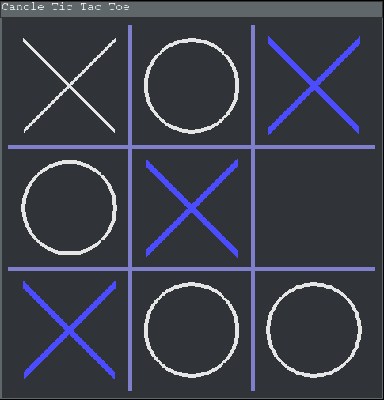

Canole Tic Tac Toe
===================

A Tic-Tac-Toe game that never loses, made with C and OpenGL.

"Canole" stands for "C ANd OpengL" and also "CAnNOt LosE"

Build
-----

*On GNU/Linux:*

Requires freeglut to be installed, then:

    $ ./builddeps.sh
    $ make

License
-------

Released under GPLv3, see COPYING for mor information.
